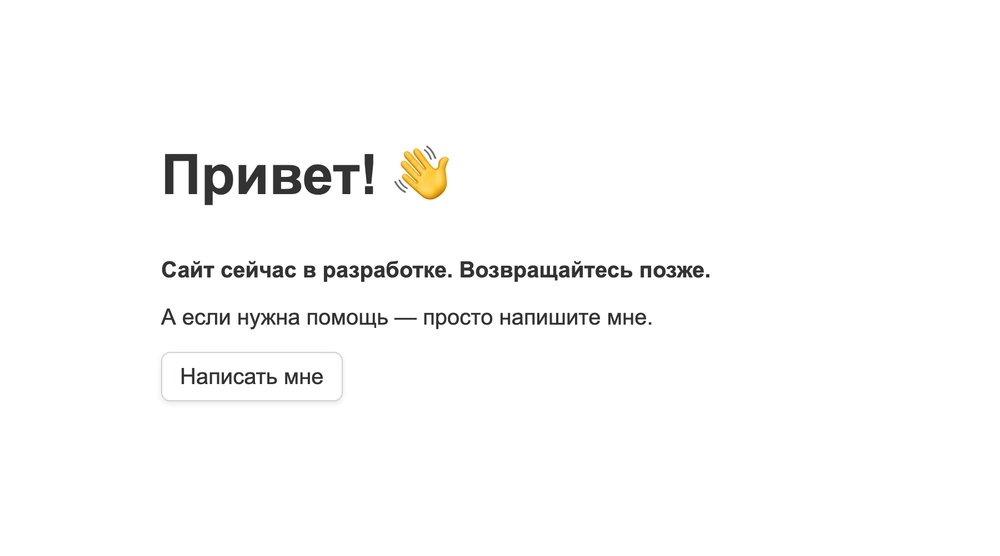
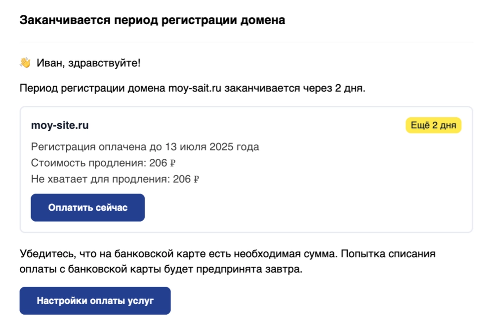
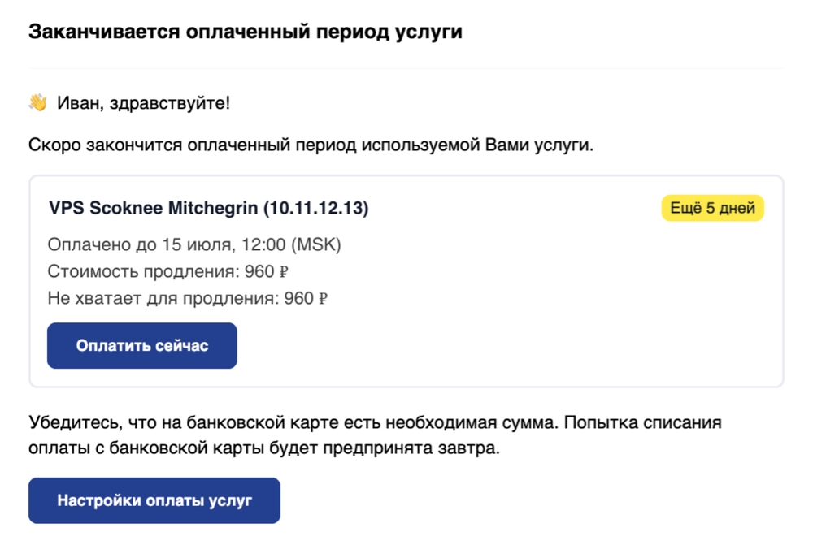

# 域名停放页面服务上线：让闲置域名也能优雅展示

你注册了域名，但网站还没搭好？与其让访客看到冰冷的404错误，不如用一个精心设计的停放页面告诉他们"这里正在酝酿好东西"。我们刚推出的免费域名停放页面服务，让你的域名从注册第一天起就显得专业可信。8种视觉模板随心选，自定义文案和字体，还自带SSL证书——最重要的是，完全免费，不需要额外购买主机。

---

## 什么是域名停放页面?

简单说,就是给暂时没有网站的域名穿上一件"得体的外衣"。

我们提供了8种不同风格的模板,每种都能自定义内容和字体,让你的域名看起来不像"荒废的空地",而更像"即将开业的店铺"。

## 哪些情况下你会用到它?

**刚注册域名,网站还在规划中**  
不想让域名空着,但又没准备好正式内容?停放页面就是最好的过渡方案。

**项目暂停,但域名要保持活跃**  
也许你的项目需要缓一缓,但域名不能就这么"死"在那里。一个简单的说明页面能让偶然访问的人知道这里依然有人在维护。

**囤了一堆好域名,准备以后用**  
很多人会提前注册心仪的域名。与其让它们显示错误页面,不如放上一句"This domain is reserved for future use"——既专业又有仪式感。

**想出售域名**  
👉 [直接在停放页面上写"此域名出售",留下联系方式](https://cp.gthost.com/en/join/72c7e6b2fc118929f9ede2978f008806)。比让买家看到空白页或错误提示强多了。

## 为什么这个服务值得用?

**不需要买主机**  
停放页面独立运行,不依赖虚拟主机或服务器。注册域名后直接开启,零额外成本。

**告别尴尬的错误页面**  
访客不会再看到"此网站无法访问"或者"域名已注册但未绑定网站"这种让人摸不着头脑的提示。

**让域名显得"活着"**  
即使网站没做好,一个干净的停放页面也能传递"这个项目是认真的"这个信号。这对品牌信任很重要。

**自动配置SSL证书**  
停放页面支持HTTPS访问,浏览器地址栏不会出现"不安全"警告。这年头,没有SSL的网站很难获得信任。

## 怎么开通?

进入个人中心,找到"域名和DNS"版块,点几下就能激活停放页面服务。整个过程不超过两分钟。

选好模板,填上你想展示的文字(比如"网站建设中"或"敬请期待"),选个喜欢的字体,保存。域名立刻就有了一个像样的门面。

---

## 邮件通知也变得更清爽了

顺便说一下,我们重新设计了邮件通知系统。

以前的邮件信息太杂,找个关键数据要翻半天。现在每封通知都只保留必要信息,而且可以直接在邮件里点按钮完成续费,不用再登录后台。

这两张截图展示了新版邮件的样子:简洁,清晰,操作方便。

---

## VPS新增AlmaLinux 10等系统

Mnogoweb的虚拟服务器现在支持安装最新的RHEL系操作系统:

- AlmaLinux 10
- Rocky Linux 10  
- Oracle Linux 10
- CentOS 10
- AlmaLinux 9.6
- RockyLinux 9.6
- Oracle Linux 9.6

**RHEL 10有什么新东西?**

内核升级到Linux 6.12,开发工具链全面更新:GCC 14.2、Python 3.12、Ruby 3.3、OpenJDK 21、Rust 1.84.1、Go 1.23、Node.js 22、Perl 5.40、PHP 8.3。

Web服务器和数据库也是最新版本:Nginx 1.26、Apache 2.4.62、MariaDB 10.11、MySQL 8.4、PostgreSQL 16。

SSH服务器升级到OpenSSH 9.9,系统核心组件glibc 2.39、DNF 4.20、RPM 4.19都是最新稳定版。

**一些值得注意的变化:**

Cockpit网页控制台新增了文件管理器,可以直接在浏览器里操作服务器上的文件和文件夹。需要安装cockpit-files包才能启用。

Sendmail已经停止支持,官方推荐迁移到Postfix。  
Redis也被Valkey取代。  
Apache的mod_security模块和SpamAssassin被移到了EPEL仓库,不再默认提供。

---

## 总结一下

域名停放页面服务解决了一个很实际的问题:让还没准备好的域名也能体面示人。免费、易用、自带SSL,两分钟就能搞定。👉 [如果你正在寻找可靠的域名和主机服务商,Gthost在这些基础服务上做得很扎实](https://cp.gthost.com/en/join/72c7e6b2fc118929f9ede2978f008806)——无论是刚起步的个人项目,还是需要稳定运行的商业网站,都能找到合适的方案。
